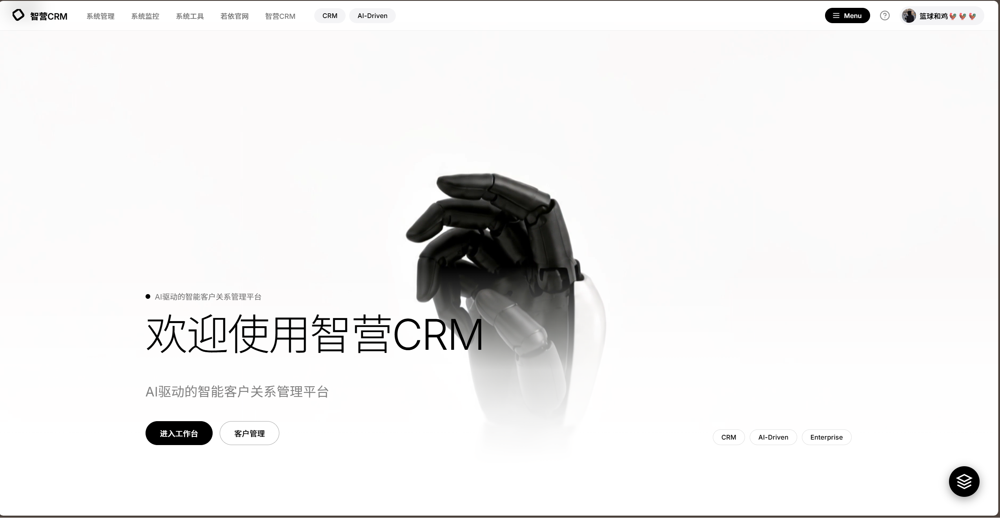
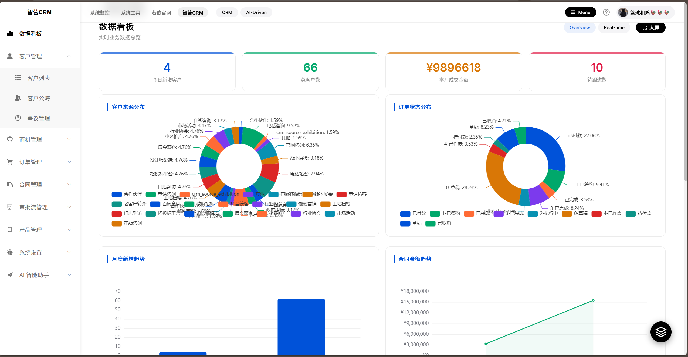
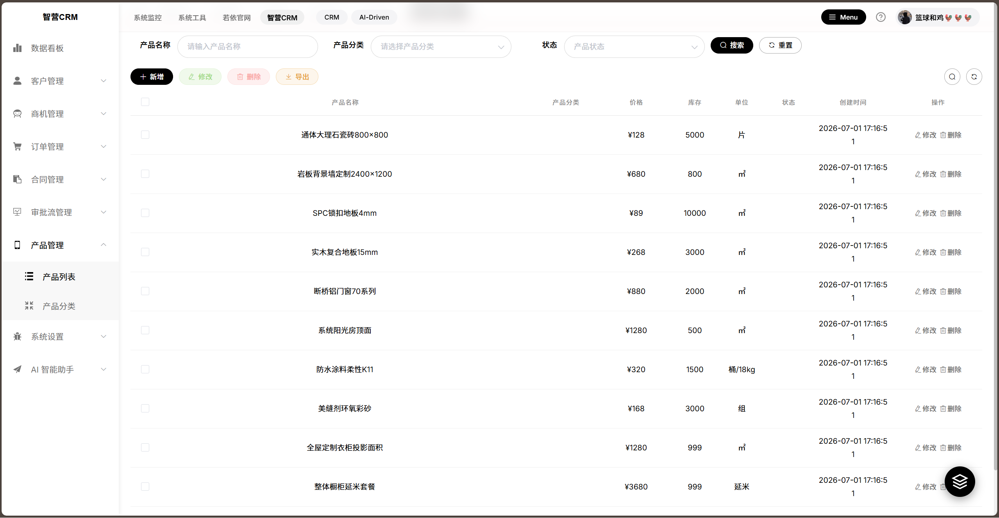
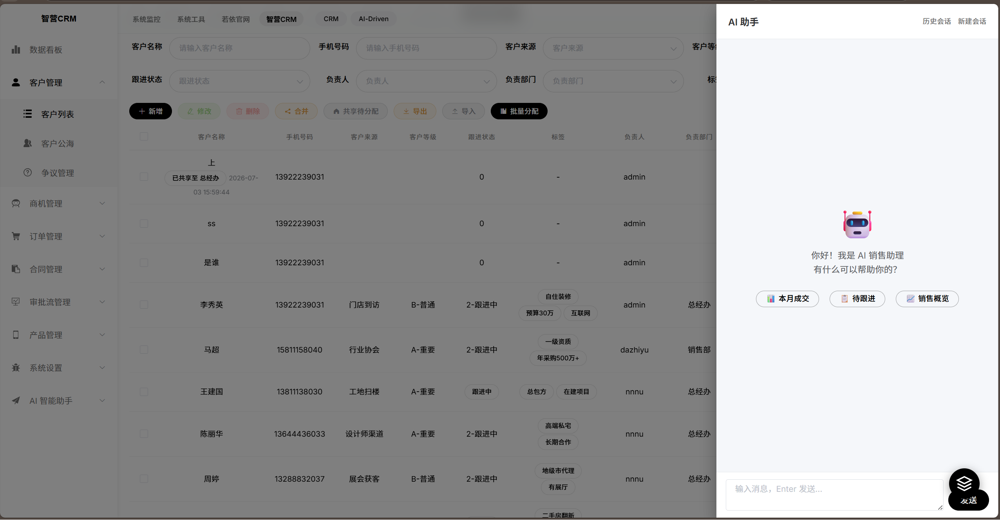
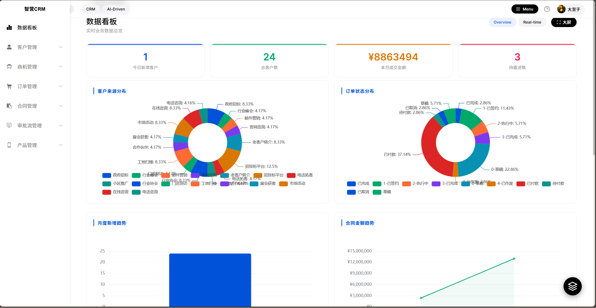
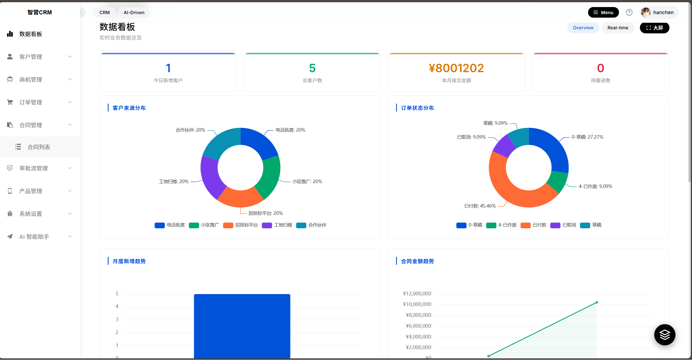
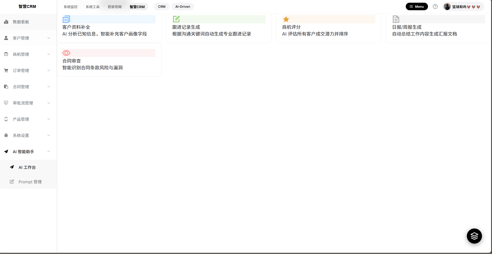

<p align="center">
  
</p>
<h1 align="center">智营 CRM · IntelliBuild CRM</h1>
<p align="center">
  <b>AI 驱动的建材销售智能客户关系管理系统</b>
</p>
<p align="center">
  <a href="#"></a>
  <a href="#"></a>
  <a href="#"></a>
  <a href="#"></a>
  <a href="#"></a>
</p>

---

## 📋 项目简介

**智营 CRM** 面向建材销售行业的智能客户关系管理系统。前后端分离架构，集成 AI Copilot 流式对话助手，提供客户全生命周期管理、销售管道追踪、数据看板分析等核心功能。

### 技术栈

| 层次 | 技术 |
|------|------|
| 后端 | Spring Boot 2.5.15, MyBatis, Spring Security, Redis, Jwt |
| 前端 | Vue 2.6.12, Element UI, ECharts |
| 数据库 | MySQL 8.0 |
| 构建 | Maven, npm |

---

## ✨ 核心功能

### CRM 全流程管理

| 模块 | 说明 |
|------|------|
| 📋 **客户管理** | 客户信息 CRUD、分配、公海池（放入/领取/分配）、查重合并、批量导入导出 |
| 📞 **跟进记录** | 客户跟进历史，支持多种跟进方式记录 |
| 📦 **订单管理** | 订单创建、明细管理、状态流转 |
| 📄 **合同管理** | 合同签订、归档、关联订单 |
| 📈 **销售管道** | 线索 → 意向 → 报价 → 成交 → 回款，全流程可视化 |
| 🏷️ **产品管理** | 产品分类 + 产品信息维护 |
| 💰 **回款计划** | 回款跟踪与计划管理 |
| 🔔 **通知消息** | 系统内通知推送 |

### AI 智能能力

- 🤖 **AI Copilot** — 流式对话助手，自然语言查询客户、订单、合同数据
- 🧭 **角色化操作指南** — 按角色（销售/经理/管理员）定制引导

### 数据看板

- 📊 客户统计总览（总数、新增、公海、跟进）
- 📉 客户来源 / 等级分布
- 🥤 销售漏斗分析
- 📈 跟进趋势图

---

## 🎨 设计风格

**黑白极简 (Black & White Minimal)**

- 主色：`#000` / `#fff` / `#f4f4f6`
- 字体：Inter (Google Fonts)
- 毛玻璃导航 + pill 风格 UI
- 视频背景登录页 + 磨砂玻璃卡片 + 鼠标视差特效
- 模块独立色彩系统

| 模块 | 强调色 |
|------|--------|
| Dashboard | `#0052D9` 蓝 |
| 客户 | `#00A86B` 绿 |
| 订单 | `#7C3AED` 紫 |
| 合同 | `#0891B2` 青 |
| 跟进 | `#D97706` 琥珀 |
| 管道 | `#FF6B35` 橙 |
| 产品 | `#DC2626` 玫红 |
| 通知 | `#4F46E5` 灰蓝 |
| 回款 | `#0D9488` 碧绿 |
| 公海 | `#4338CA` 靛蓝 |

---

## 🖥️ 页面预览

### 1. 超级管理员主页面

超级管理员拥有系统全部权限，包括系统管理、CRM 管理等完整菜单。

<p align="center">
  
</p>

---

### 2. 超级管理员工作台页面

工作台聚合关键业务数据与快捷操作入口。

<p align="center">
  
</p>

---

### 3. 建材产品管理页面

对建材产品进行分类管理与信息维护，支持产品上下架管理。

<p align="center">
  
</p>

---

### 4. AI 助手模块

集成 AI Copilot，支持自然语言查询客户、订单、合同等数据。

<p align="center">
  
</p>

---

### 5. 经理工作台页面

经理角色拥有 CRM 业务相关菜单，相比超级管理员少了系统管理、菜单管理等后台管理功能。

<p align="center">
  
</p>

---

### 6. 员工数据分析仪表盘页面

员工账号可查看个人相关的客户、订单、跟进等数据分析仪表盘。

<p align="center">
  
</p>

---

### 7. AI 助手页面（拓展）

AI 助手拓展页面，提供更丰富的对话交互与智能分析能力。

<p align="center">
  
</p>

---

## 🗄️ 数据库结构（11 张 CRM 表）

| 表名 | 说明 |
|------|------|
| `crm_customer` | 客户信息（含公海标记、归属人） |
| `crm_followup` | 跟进记录 |
| `crm_order` | 订单 |
| `crm_order_item` | 订单明细 |
| `crm_contract` | 合同 |
| `crm_pipeline` | 销售管道 |
| `crm_product` | 产品 |
| `crm_product_category` | 产品分类 |
| `crm_notification` | 通知消息 |
| `crm_payment_plan` | 回款计划 |
| `crm_customer_pool_log` | 公海操作日志 |

---

## 🚀 快速启动（用户指南）

### 环境要求

- JDK 1.8+
- Maven 3.6+
- MySQL 8.0
- Redis
- Node.js 14+

---

### 第一步：初始化数据库

项目使用 MySQL 8.0，首次使用前需要先导入数据库脚本。

```bash
# 1. 登录 MySQL
mysql -u root -p

# 2. 创建数据库
mysql> CREATE DATABASE IF NOT EXISTS `ry-vue` DEFAULT CHARACTER SET utf8mb4 COLLATE utf8mb4_general_ci;
mysql> exit

# 3. 导入项目提供的 SQL 脚本（含表结构 + 初始数据）
mysql -u root -p ry-vue < sql/ry-vue.sql
```

> `sql/ry-vue.sql` 包含完整的数据库表结构和演示数据，是项目正常运行的前提，**必须执行**。

---

### 第二步：修改数据库连接配置

打开 `ruoyi-admin/src/main/resources/application-druid.yml`，修改数据库连接信息为你自己的配置：

```yaml
# 第 9-11 行
url: jdbc:mysql://localhost:3306/ry-vue?useUnicode=true&characterEncoding=utf8&zeroDateTimeBehavior=convertToNull&useSSL=true&serverTimezone=GMT%2B8
username: root          # 改为你的数据库用户名
password: password  # 改为你的数据库密码
```

---

### 第三步：配置 Redis

打开 `ruoyi-admin/src/main/resources/application.yml`，确认 Redis 连接配置：

```yaml
# 第 40-45 行左右
redis:
  host: localhost
  port: 6379
  password:       # 如未设密码则留空
```

确保本地 Redis 服务已启动。

---

### 第四步：启动后端

```bash
# 构建项目
mvn clean install -DskipTests

# 启动服务
java -jar ruoyi-admin/target/ruoyi-admin.jar
```

后端默认启动在 `http://localhost:8080`。

---

### 第五步：启动前端

```bash
cd ruoyi-ui

# 安装依赖
npm install

# 开发模式运行（热更新）
npm run dev
```

前端默认启动在 `http://localhost:1024`，浏览器打开即可访问。

> 如需打包部署，使用 `npm run build:prod`，产物在 `ruoyi-ui/dist/`。

---

### 默认账号

| 角色 | 账号 | 密码 |
|------|------|------|
| 管理员 | admin | admin123 |
| 普通用户 | ry | admin123 |

---

## 📁 项目结构

```
ruoyi-admin/          # 后台管理模块（Controller）
├── controller/crm/   # CRM 接口（11 个 Controller）
ruoyi-system/         # 系统业务模块
├── domain/crm/       # 领域模型（11 个）
├── mapper/crm/       # Mapper 接口 + XML（11 套）
├── service/crm/      # 业务逻辑（11 接口 + 实现）
ruoyi-ui/src/
├── views/crm/        # 前端页面（11 个模块）
├── api/crm/          # API 接口（11 个文件）
└── styles/           # 全局样式
```

---

## 📜 许可证

[MIT License](LICENSE)

> 基于 [RuoYi-Vue](https://gitee.com/y_project/RuoYi-Vue) 3.9.0 二次开发
